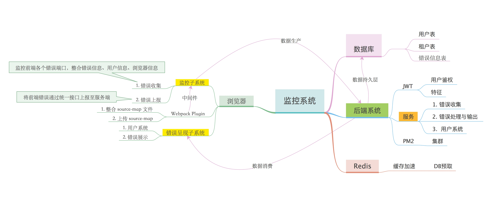
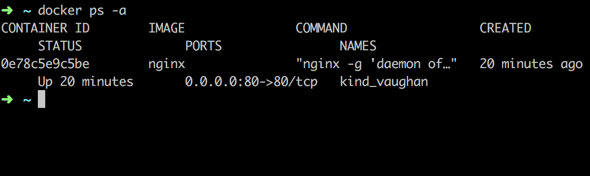
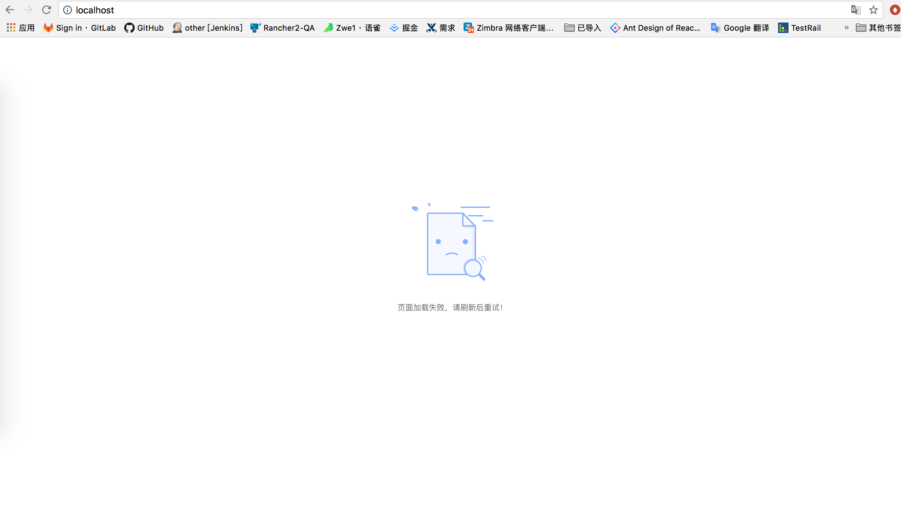

## 错误监控系统 (client)

### 目标

针对 B 端应用难以分析远程错误，设想构建一个错误收集监控系统，以便错误记录与收集并展示。

### 架构

整个系统包含前端系统，source-map [插件](https://github.com/Zwe1/error-monitor-webpack-plugin) 和 [后端系统](https://github.com/Zwe1/error-monitor-node-server)，及数据库服务。前端收集上报发送错误信息到服务端，服务端处理收集存储错误信息到数据库，并支持前端获取处理后的错误信息，在前端进行集中展示。



### 项目表述

该项目由 create-react-app 搭建，进行 override webpack config 操作来扩展打包配置。进行错误生产，作为整个系统的前端实验室。

### 基本功能

1. 错误上报
2. 错误展示
3. ci 系统 (hard)

### 难点

1. 分层拦截错误

2. 如何在本地搭建一个生产环境？

为了能够验证 production 模式打包后的 sourcemap。我们需要在本地搭建一个前端生产环境。这里考虑用 nginx 作为前端服务器，放置在 docker 容器当中，这种方式十分方便和高效，一台物理机就可以完成所有工作。

````md
1. 首先我们需要安装 [docker](https://www.docker.com/)

2. 下来拉取 nginx 镜像。

   docker pull nginx

3. 创建 nginx 相关目录

mkdir -p /data/nginx/{conf, conf.d,logs}

这里我们在宿主机的 /data/nginx 目录放置 nginx 相关的文件，这个目录是可自定义的，但后续的目录映射一定要保证和这个目录相同。

4. 新建 nginx 配置文件

   touch /data/nginx/conf/nginx.conf
   vim /data/nginx/conf/nginx.conf

   ```conf
   user nginx;
   worker_processes  1;
   error_log  /var/log/nginx/error.log warn;
   pid        /var/run/nginx.pid;
   events {
       worker_connections  1024;
   }

   http {
       include      /etc/nginx/mime.types;
       default_type  application/octet-stream;
       log_format  main  '$remote_addr - $remote_user [$time_local] "$request" '

                       '$status $body_bytes_sent "$http_referer" '

                       '"$http_user_agent" "$http_x_forwarded_for"';
       access_log  /var/log/nginx/access.log  main;
       sendfile        on;
       #tcp_nopush    on;
       keepalive_timeout  65;
       #gzip  on;
       include /etc/nginx/conf.d/*.conf;
   }
   ```

   5. 新建 default.conf

   touch /data/nginx/conf.d/default.conf
   vim /data/nginx/conf.d/default.conf

   ```conf

    server {
    listen      80;
    server_name  localhost;
    location / {
        root  /usr/share/nginx/html;
        index  index.html index.htm;
        autoindex  on;
    }

    error_page  500 502 503 504  /50x.html;

    location = /50x.html {

        root  /usr/share/nginx/html;

    }
   ```

   到这里，有关于 nginx 配置的处理就完成了，下来我们要做的就是进行 docker 容器与宿主机的目录映射

   6. 将 nginx 内容挂载到宿主机

   docker run -p 80:80 -d -v /Users/xxx/Documents/lab/error-monitor/react-repo/build:/usr/share/nginx/html -v /data/nginx/logs:/var/log/nginx -v /data/nginx/conf/nginx.conf:/etc/nginx/nginx.conf -v /data/nginx/conf.d:/etc/nginx/conf.d docker.io/nginx

   这里可以看到我们映射了两个目录和两个配置文件，包括了前端 html 文件目录，log 目录以及两个 nginx 配置文件。这里我直接将我们前端项目的打包目录映射到了容器中的 html 目录中，这样会比较方便一些。

   这里我们选择宿主机的 80 端口映射 nginx 容器的 80 端口，我们直接打开本机的浏览器访问 localhost ，就可以看到打包完后的前端项目运行起来了。如果 80 端口有其他用途 ，可以自行切换到其他端口。
````





2. source-map 解析

使用 Mozilla source-map 解析 .map 文件生成源代码
